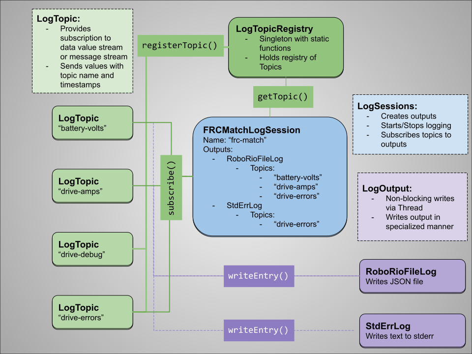

# RobotLog

_Proudly presented by FIRST Robotics Team 2357, System Meltdown_

RobotLog is a logging system tailored specifically for competition robotics and designed
for the rigors of the [FIRST Robotics Competition](https://www.firstinspires.org/robotics/frc).

Features:
 * Versatile Topic System
 * Support for logging numeric data
 * Support for error/info/debug messages
 * Session-based system with relative timestamps for events
 * Multiple simultaneous logging outputs
 * Optimized for performance and ease-of-use
 * Great for match logging and in-shop testing and debugging

## Overview

RobotLog consists of three major components:
 * LogTopic, which represents a single data variable or message stream
 * LogOutput, which outputs log entries to a medium such as stdout, stderr, or a file
 * LogSession, which ties topics to outputs



## Example Code

This is a sampling of example code that can be used to implement RobotLog topics, sessions, and outputs.

### Example of topic logging within a subsystem

Simply create logging topics and log to them as needed.

```
public class DriveSubsystem extends Subsystem {
	private StringLogTopic statusLog = new StringLogTopic("drive-status");
	private StringLogTopic errorLog = new StringLogTopic("drive-error");
	private DoubleLogTopic ampsLog = new DoubleLogTopic("drive-amps");

	public void shiftHigh() {
		statusLog.log("Shift to High Gear while at speed " + getSpeedInchesPerSecond());

		...
	}

	public void shiftLow() {
		statusLog.log("Shift to Low Gear while at speed " + getSpeedInchesPerSecond());

		...
	}

	public void driveClosedLoop(double speed, double turn) {
		if (isFailsafeActive()) {
			errorLog.log("Attempting to drive closed loop while failsafe is active!");
			return;
		}

		...
	}

	public void periodic() {
		ampsLog.log(getTotalDriveAmps());
	}

	...
}
```

### Example of a competition match logging session

Use LogSession to create outputs and link them to topics.

```
public class CompetitionLogSession extends LogSession {
	public CompetitionLogSession() {
		// "stdout" Writes informational messages to output (viewable in driver station)
		// "stderr" Writes errors to stderr output (viewable in driver station)
		// "logfile" Writes to files in /home/lvuser/logs/competition-log-##.zip

		super(Map.of(
			"stdout", new PrintStreamLogOutput(System.out),
			"stderr", new PrintStreamLogOutput(System.err),
			"logfile", new FileLogOutput("~/logs", "competition-log-"),
		));
	}

	protected void onStart() {
		subscribeTopic("drive-error", "stderr");

		subscribeTopic("drive-status", "stdout");

		subscribeTopic("drive-error", "logfile");
		subscribeTopic("drive-status", "logfile");
		subscribeTopic("drive-amps", "logfile");
	}
}
```

Then hook in the session to `startCompetition()`
No need to do anything at the end of competition, outputs flush automatically.

```
public class Robot extends TimedRobot {
	private LogSession logSession = new CompetitionLogSession();

	@Override
	public void startCompetition() {
		logSession.start();

		super.startCompetition();
	}
}
```
